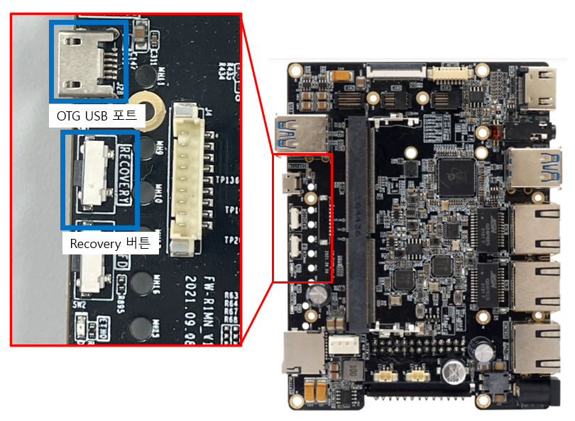
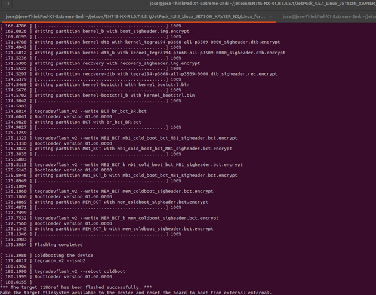

Jetson 시스템 설치 (Jetpack 4.6)
================

- 현재 사용하는 Xavier NX 모듈의 경우 내부 EMMC 16GB 이외의 스토리지가 없어 시스템 개발시 용량이 부족한 상황이 발생할 수 있다.
    따라서 외부 스토리지(SD Card)에 Rootfs 을 구성 및 사용할 수 있도록 작업한다.

- 캐리어 보드의 SD 카드 슬롯 사용을 위해서 AVerMedia 에서 제공하는 BSP 를 사용하여 시스템을 구성한다.
  - AVerMedia 에서 제공하는 BSP는 Jetpack 4.6 버전을 사용한다.
  - Jetpack 4.6의 자세한 스펙은 아래 링크에서 확인 가능하다.
    - <https://developer.nvidia.com/embedded/jetpack-sdk-46>
- NVIDIA SDK Manager GUI Tool 을 사용한다면 외부 장치에 Flash 가 불가능하여 CLI Tool 을 사용하여 진행한다.

- - -

BSP 다운로드
--------------

- AVerMedia 에서 제공하는 BSP for NX 중 EN715-NX-R1.0.15.4.6 버전을 다운받고 작업디렉토리를 구성한다.
    **<https://www.avermedia.com/professional/download/en715#parentHorizontalTab4>**
    <!-- </img> -->
    

    ```bash
    $ mkdir ~/jetson_EN715 && cd ~/jetson_EN715 # 작업 디렉토리 생성
    $ wget https://www.avermedia.com/epaper/file_https.php?file=http://ftp2.avermedia.com/EN715/EN715-NX-R1.0.15.4.6.zip # BSP 다운로드
    $ unzip EN715-NX-R1.0.15.4.6.zip # 압축 해제
    $ cat EN715-NX-R1.0.15.4.6.tar.gz.00* > EN715-NX-R1.0.15.4.6.tar.gz # 압축 해제
    $ sudo tar zxf EN715-NX-R1.0.15.4.6.tar.gz # 압축 해제
    $ cd JetPack_4.6_Linux_JETSON_XAVIER_NX/Linux_for_Tegra/ # 작업 디렉토리 이동
    ```

- - -

Rootfs를 SD Card로 복사
--------------

- SD Card를 연결 후 파티션을 초기화 해준다.
  - fdisk 를 사용하여MMC(SD Card) 장치를 찾는다.

    ```bash
    $ sudo fdisk -l
    ```

    연결 한 장치의 이름이 ‘/dev/mmcblk0’ 인것을 확인할 수 있다.
    
    **장치의 이름은 ‘/dev/mmcblk0’ 와 다를수 있다**

  - gdisk 를 사용하여 파티션을 초기화 해준다.

    ```bash
    $  sudo gdisk /dev/mmcblk0
        # 초기화 수행
        # 1. "o" -> clear all current partition data
        # 2. "n" -> create new partition
        # 3. "1" -> partition number /dev/sdx1
        # 4. "40M"first sectors -> Press enter or last sectors
        # 5. "Linux filsystem" -> using default type
        # 6. "c" -> partition's name "Part_lable"
        # 7. "w" -> write to disk and exit.
    ```

    <!-- </img> -->
    <!--  -->
  - ext4 으로 파티션을 포맷 후 PARTUUI를 확인한다.

    ```bash
    sudo mkfs.ext4 /dev/mmcblk0p1 # 파티션 포맷

    sudo blkid /dev/mmcblk0p1 blkid # PARTUUID 확인
    ```

    <!-- </img> -->
    <!--  -->
    **여기서 나오는 PARTUUID를 잘 기억한다.**

  - 설정한 SD Card의 파티션을 마운트 해주고 rootfs을 복사해준다.

    ```bash
    sudo mount /dev/mmcblk0p1 /mnt
    cd ~/jetson_EN715/jetJetPack_4.6_Linux_JETSON_XAVIER_NX/Linux_for_Tegra/
    cd ./rootfs/
    sudo tar -cpf - * | ( cd /mnt/ ; sudo tar -xpf - )
    sync
    sudo umount /mnt
    ```

    - Jetson 부팅시 Rootfs 을 SD카드로 이용하기위해서 이전에 확인한 PARTUUID를 작업 디텍로리의 bootloadr 에 uuid 설정 파일을 생성해준다.
    
    ```bash
    $  cd ~/jetson_EN715/jetJetPack_4.6_Linux_JETSON_XAVIER_NX/Linux_for_Tegra/
    $ echo “{이전에 기억한 PARTUUID}”> ./bootloader/l4t-rootfs-uuid.txt_ext
    # ex) echo "7ff2c84e-86d3-4008-87b0-bdf1aed62481" > ./bootloader/l4t-rootfs-uuid.txt
    ```
<!-- 
    </img>
     -->

- - -

Kernel 및 Bootloader 설치
--------------------

- Xavier NX 보드를 Recovery mode 로 부팅 후 OTG USB 포트를 사용하여 PC 와 연결 한다.
    <!-- </img> -->
    
- flash 스크립트를 실행 시켜 설치를 진행한다.

    ```bash
    $ cd ~/jetson_EN715/jetJetPack_4.6_Linux_JETSON_XAVIER_NX/Linux_for_Tegra/
    $ sudo ./flash.sh jetson-xavier-nx-en715 external
    ```

    - 실행 화면
        <!-- </img> -->
        

- - -

부팅
----------

- 설치 완료 후 SD Card를 케리어보드에 장착 후 재부팅하여 Ubuntu 설치를 확인 할 수 있다.
    <!-- </img> -->
    
