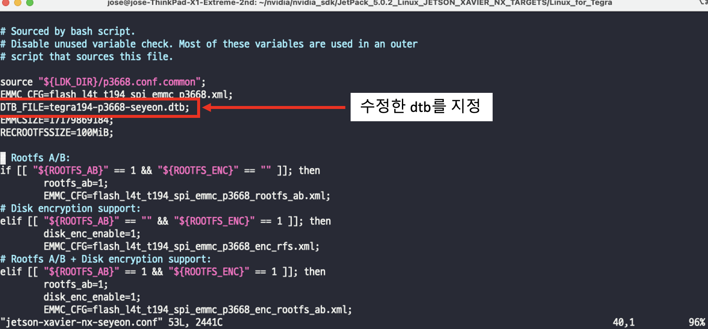
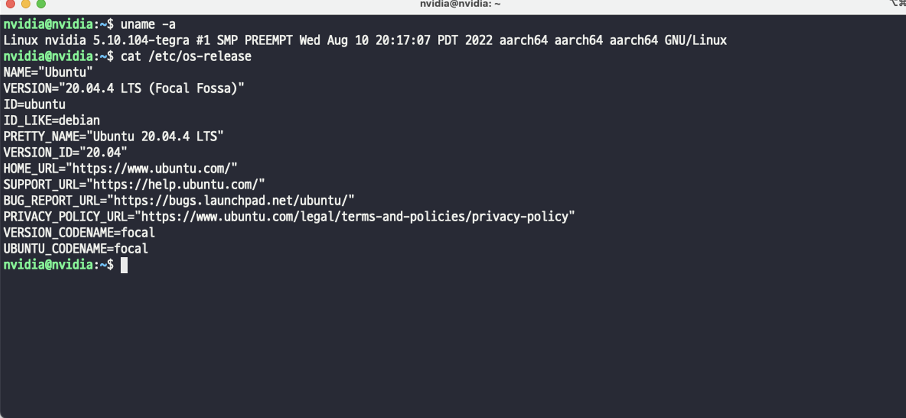

Jetson 시스템 설치 (Jetpack 5.0.2)
================

- 현재 사용하는 Xavier NX 모듈의 경우 내부 EMMC 16GB 이외의 스토리지가 없어 시스템 개발시 용량이 부족한 상황이 발생할 수 있다.
    따라서 외부 스토리지(SD Card)에 Rootfs 을 구성 및 사용할 수 있도록 작업한다.

- 캐리어 보드는 FlexWatch 의 FWR100-BB 를 사용하였다.
  - NVIDIA에서 제공하는 SDKManager를 사용하여 BSP 다운 및  Jetpack 5.0.2 설치를 진행한다.
  - Jetpack 의 자세한 스펙은 아래 링크에서 확인 가능하다.
    - <https://developer.nvidia.com/embedded/jetpack>

- - -

BSP 다운로드 및 구성
--------------

- SDKmanager 를 통해서 jetpack 5.0.2 을 사용하여 xavier nx 에 설치한다.
  - 아래 링크에서 NVIDIA SDK Manager 를 다운받는다. (로그인 필요)
    - <https://developer.nvidia.com/nvidia-sdk-manager>
    

  - 다운 받은 패키지 파일을 아래 명령어를 통해서 실행 시켜 설치를 진행 후 실행한다.
    ```bash
    $ sudo apt install ./sdkmanager_1.7.0-8846_amd64.deb

    $ sdkmanager
    ```

  - Xavier NX 보드를 Recovery mode 로 부팅 후 OTG USB 포트를 사용하여 PC 와 연결 한다.
    <!-- </img> -->
    
  
  - Target Hardware 및 Target OS 를 선택한다.
    - PC 와 Jetson 보드가 연결되어 있다면 해당 보드가 감지된다.
    - Target OS 의 경우 최신 버전인 Jetpack5.0.1를 사용하여 설치를 진행한다.
    - Jetson Component 는 따로 설치를 진행하지 않는다 (체크해제)
      


      
  
  - 설치 완료 후 아래 위치에 설치를 위한 BSP 가 생성됨을 확인할 수 있다.
    - $HOME/nvidia/nvidia_sdk/JetPack_5.0.2_Linux_JETSON_XAVIER_NX_TARGETS/Linux_for_Tegra
      

- - -

Rootfs를 SD Card로 복사
--------------

생성된 BSP를 사용하여 외부 스토리지(SD Card)에 Rootfs 을 구성하여 사용할수 있도록 설치를 진행한다.

- SD Card를 PC에 연결 후 파티션을 초기화 해준다.
  ```bash
  $ sudo gdisk /dev/mmcblk0 
    #sd card 장치 이름: (/dev/mmcblk0), “fdisk -l” 을 사용하여 확인가능 
    "o" -> clear all current partition data
    "n" -> create new partition
    "1" -> partition number /dev/mmcblk0p1
    "40M"first sectors -> Press enter or last sectors
    "Linux filsystem" -> using default type
    "w" -> write to disk and exit

  $ sudo mkfs.ext4 /dev/mmcblk0p1
  #생성한 파티션을 ext4 으로 포맷
  ```
- Rootfs 설정 및 복사
  - 초기부팅시 사용자 등록과정을 생략하기위해서 사용자 생성하며 sd 카드로 rootfs을 복사한다.
    ```bash
    $ sudo mount /dev/mmcblk0p1 /mnt 
    $ cd HOME/nvidia/nvidia_sdk/JetPack_5.0.2_Linux_JETSON_XAVIER_NX_TARGETS/Linux_for_Tegra
    $ sudo ./l4t_create_default_user.sh -u nvidia -p root -n nvidia -a --accept-license
      # 사용자 등록: -u {username} -p {password} -n {hostname} -a --accept-license 

    $ cd rootfs
    $ sudo tar -cpf - * | ( cd /mnt/ ; sudo tar -xpf - )
    $ sync
    $ sudo umount /mnt
    ```

- - -


Jetson Flash 
--------------
본 문서에서 사용된 캐리어 보드 FlexWatch의 FWR100-BB의 SD Card 슬롯 사용을 위해서 수정된 Device tree를 사용한다.
수정된 Device tree적용 및 Xavier로 kernel, bootloader 설치를 진행해준다.


- 수정된 Device tree 적용
  - 제공된 Device tree 파일을 복사 후 사용 할 수있도록 flash config를 수정한다.
    - dtb 복사 
  
    ```bash
      $ cd $HOME/nvidia/nvidia_sdk/JetPack_5.0.2_Linux_JETSON_XAVIER_NX_TARGETS/Linux_for_Tegra/kernel/dtb
      $ sudo cp ./tegra194-p3668-seyeon.dtb  ./
    ```
    
    - jetson-xavier-nx-devkit-emmc.conf 파일을 수정 

    ```bash
        $ cd $HOME/nvidia/nvidia_sdk/JetPack_5.0.2_Linux_JETSON_XAVIER_NX_TARGETS/Linux_for_Tegra
        $ sudo vi jetson-xavier-nx-devkit-emmc.conf
    ```

    


- Xavier Flash
  - Xavier NX 를 리커버리 모드로 PC 와 연결한다.
  - 아래 명령을 사용하여 flash 수행
  
    ```bash
        $ cd $HOME/nvidia/nvidia_sdk/JetPack_5.0.2_Linux_JETSON_XAVIER_NX_TARGETS/Linux_for_Tegra
        $ sudo ./flash.sh jetson-xavier-nx-devkit-emmc mmcblk1p1
    ```

- 설치 완료 후 Rootfs을 구성한 SD카드를 케리어 보드에 연결 후 부팅한다.
- 부팅 수행 및 설치를 확인

    


