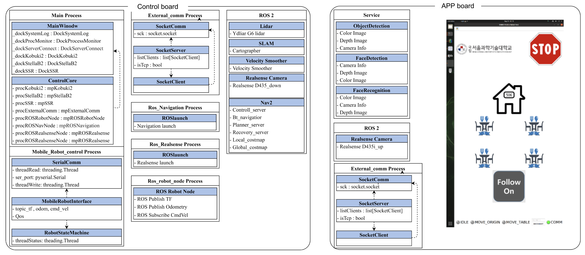

개요
===

서비스 로봇을 위한 기능 구현을 위해서 ROS2.0 기반의 확장 가능한 유연한 소프트웨어 구조를 채택
개발언어는 Python을 사용한다. 

- AI 기술을 사용한 인간친화적 서비스 기술을 이미 구현된 Python 패키지를 통하여 쉽게 적용가능
- 다양하고 유용한 Python 패키지 모듈의 제공으로 쉽고 빠른 개발가능
- ROS사용으로 구현에 필요한 적합한 수많은 유용한 패키지를 조합하여 integration 하여 보다 손쉽게 로봇개발 가능

- - - 

기술
-----------

|       항목       |                         종류                          |
| :--------------: | :---------------------------------------------------: |
| 지원 로봇 플랫폼 |            Kobuki 2, Stella b2, EXA-robot             |
|     AI Core      | TTS, STT ,Facecognition, Obeject Detection & Tracking |
|    Navigation    |                   Navagation2 Stack                   |
|       SLAM       |                     Cartographer                      |
|   ROS2 package   |         Cartographer, Realsense, Nav2, Lidar          |

- - - 

EXA 로봇 적용 예시
-----------

EXA 로봇 제어를 위해 컨트롤 보드에 적용된 소프트웨어 구조는 아래와 같다.

<!-- </img> -->
<!--  -->

- - - 

<!-- - 테스트 영상
<iframe width="600" height="400" src="https://www.youtube.com/embed/eUQFtpxet1k" title="2019 CNU 임베디드 챌린지 3조 1차 주행 (성공)" frameborder="0" allow="accelerometer; autoplay; clipboard-write; encrypted-media; gyroscope; picture-in-picture" allowfullscreen></iframe> -->

